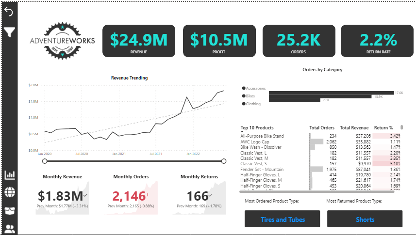
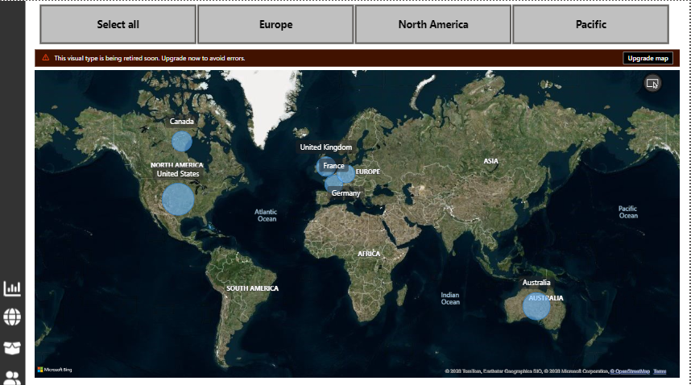
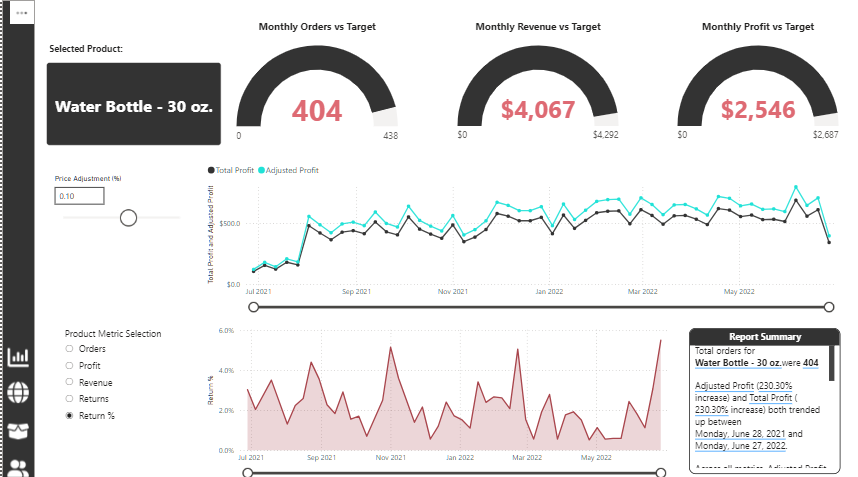
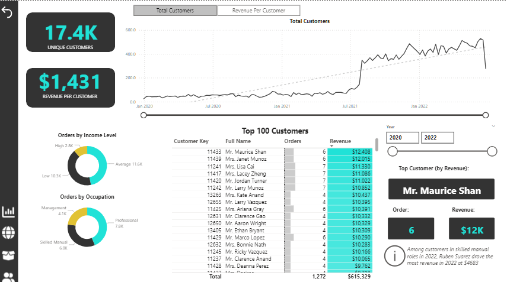

# AdventureWorks-Sales-Customer-Analytics-Dashboard
## Download Report
Download the Power BI report file:
[AdventureWorks.pbix](AdventureWorks.pbix)

## Business Scenario
In this project, I assumed the role of a Business Intelligence Analyst at AdventureWorks, a global manufacturer of cycling equipment and accessories.
Management required an interactive analytics solution to monitor business KPIs, evaluate regional sales performance, analyze product trends, and identify high-value customers.
The dataset consisted of multiple raw CSV files containing information on transactions, returns, products, customers, and sales territories.

## Tools & Technologies
- Power BI Desktop
- Power Query
- DAX (Data Analysis Expressions)
- Data Modeling
- CSV Data Sources

## Data Preparation
- Imported multiple CSV datasets from local storage
- Cleaned and transformed data using Power Query
- Added calculated columns and transformations
- Merged queries and prepared structured datasets for modelling

## Data Modeling
- Built a relational data model across multiple tables
- Created calculated measures using DAX
Examples of functions used:
- CALCULATE
- DIVIDE
- ALL
- SWITCH
- FILTER
- Time intelligence functions
- Text functions

Example measures included:
- Profit
- Profit Target Gap
- Previous Month Profit
- 90-Day Rolling Profit
- Adjusted Profit

## Dashboard Pages
# Executive Overview

Executive-level dashboard for monitoring key business metrics.
Key KPIs included:
- Revenue
- Profit
- Orders
- Return Rate
# Features:
- Revenue trend analysis
- Top product performance
- Monthly performance tracking
- Category comparisons

## Regional Sales Analysis

Global sales performance visualization.
# Features:
- Map visual displaying sales activity by region
- Region filtering (Europe, North America, Pacific)
- Geographic performance comparisons

## Product Detail Analysis

Detailed analysis of product performance.
# Features:
- Monthly orders vs target
- Monthly revenue vs target
- Monthly profit vs target
- Product-level trend analysis
- Adjustable price scenario analysis
- Smart narrative summary

## Customer Insights

Customer analytics and segmentation.
# Features:
- Unique customer metrics
- Revenue per customer
- Top 100 customers ranking
- Customer segmentation by income level and occupation
- Customer performance tracking over time

## Advanced Analytics Features
The dashboard includes advanced Power BI analytical capabilities:
- Key Influencers visual to identify drivers of price changes
- Decomposition Tree for hierarchical analysis
- Q&A visual enabling natural language queries
- Custom tooltips for contextual insights
- Drill-down and drill-through navigation
- Bookmarks and navigation buttons
- Interactive slicers and filters
  
## Additional Model Documentation
The project also includes technical documentation inside the Power BI model:
- Data dictionary
- Model information
- Measure definitions
- Table metadata
This documentation supports transparency and maintainability of the BI model.

## Dataset
The dataset consists of multiple CSV files containing information about:
- Sales data
- Returns data
- Product categories lookup
- Product Subcategory Lookup
- Product lookup
- Customer lookup
- Calendar lookup
- Territory lookup

## Skills Demonstrated
- Data Transformation (Power Query)
- Data Modeling
- DAX Calculations
- Business Intelligence Reporting
- Interactive Dashboard Design
- Advanced Power BI Visualizations

## Project Structure
# AdventureWorks-Sales-Customer-Analytics-Dashboard
│
- ├── AdventureWorks Report.pbix
- ├── README.md
- │
- ├── Screenshots
- │   ├── Executive Dashboard
- │   ├── Customer Detail
- │   ├── Product Detail
- │   ├── Map Visuals

## Outcome
The final solution provides a multi-page interactive dashboard enabling users to analyze sales performance, explore customer behavior, evaluate product trends, and monitor key operational KPIs.
This project demonstrates the full Power BI workflow:
- Data transformation
- Data modeling
- DAX calculations
- Interactive report design
- Advanced analytics visuals
